# lesson 1 

## masculine

| 1 | 2 |
| :---: | :---: |
| -o, -u | le vélo, le bureau, le munu |
| -age, -eau| le voyage, le château, le gâteau |
| -ment, -isme| le moment, le gouvernement, le tourisme|
| -s, -x | le bus, le prix, le choix |
| 季节，月份，星期，方向，数字| l 'été, le janvier, le lundi, le nord, le deux|

1. le ménager
2. le monde 
3. le obstacle
4. le example
5. le livre
6. le site 
7.  le programme 

## feminin

| 1 | 2 |
| :---: | :---: |
| -e | la table, la voiture, la musique |
| -ée | la clé, la poupée |
| -té, -tion | la liberté, la nation |
| -ure, -ie | la nature, la culture, la vie |
| coulour, fruit, plant| la pomme, la rose|

1. la cour
2. la cuisine
3. la maison

## vocabulaire

1. La cinquantaine 
2. agriculteur
3. veuf ou célibataire
    1. spouse passed away
4. travailleur
5. sérieux
6. inquiet
7. râleur
    1. always whining
8. agence matrimonial
9. petie
    1. short
10. chauve
    1. bold
11. aime regarder certains reportages à la télévision
12. fini les soucis
    1.  finie la cigarette
    2.  finies les vacances
13. l'une d'entre elles
14. un reportage
15. Pour A, xxxx et quant à B, xxxx

---

## 24.6.1 - 1

1. le jardin des couleurs captives 
   1. captivate
2. un problème facile à comprendre
3. quitter la grisaille(阴沉) pour se retrouver dans cet endroit agréable à visiter 
4. institutrice, instituteur dans une école(小学)
5. J'ai entendu parler de votre festival
6. des guids adaptent(adapt) les dicours en fonction de l'âge des enfants 
7. Il faut compter plusieurs heures pour faire cela 
8. dites-moi en ce qui concerne pour manger
   1. en termes de pour manger 
   2. about
9. par contre(conversely )
   1.  par contre, vous pouvez choisir cela 
10. un château en libre accès(free access)
11. l'ensemble des scolaires 
    1.  group of students
12. deux jours à l'avance
    1.  prévenir qn à l'avance 
    2.  Tout a été préparé à l'avance
    3.  réserer à l'avance 
13. prévoir un changement de temps(预料，预测天气变化)
14. domaine de château de Versailles(park of ...)
15. Neuf virgule cinquante(9.5)
16. avoir un horaire chargé(have a tight schedule)
    1.  Horaires et tarif sur www.xxx
17. indiquer la sortie à qqn(indicate the exit to someone)
18. une cuisine inventive(innovative) et raffinée(refined) conçue(convevoir) autour de théme du festival 
    1.  Elle a préparé un certain nombre de mets raffiné
19. situé à proximité du château = a côté du château 
20. Pâtes(noodles) fraîches et sauces à volonté(all you like)
21. Aujourd'hui, le gâteau symbolise le partage et la convivialité
22. métier artisanale(手工行业)
    1.  glaces artisanale(handmade ice-cream)
23. ouverture de 12h à 15h (open at ....)
24. Le centre de formation propose des formation ouvertes à tous(here formation means training )
7. 

---

## 24.6.2 - 1

7. 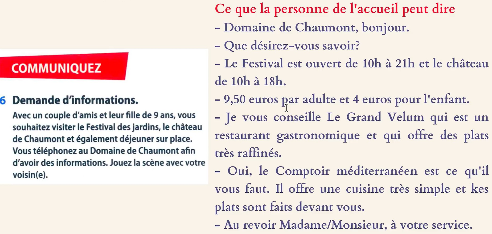
7. 
7. 
8. Notre objectif est de construire un supermarché dans ce vieux quartier 
9. La satisfaction du client est notre objectif 
10. Merci encore de ton engagement dans cette opération(activity)
11. 
11. 
    1.  bosser = travail, oral 
12. s'informer = se renseigner 
13. se baigner pour se rafraîchir 
    1.  mettre du vin à rafraîchir 
    2.  se fraîchir (make oneself cool, have cold drinks )
14. se faire masser 
15. se faire couper les cheveux chez le coiffeur
16. déclarer ses intentions à qn 
    1.  Je déclare que je n'accepterai aucun compromis 
    2.  Il ne veut pas se déclarer sur ce point(发表意见)
17. David a enfin osé m'aborder
    1.  aborder 靠近，上前交谈
18. Nous nous sommes donc retrouvés devant l'entrée du métro(约定在。。。见面)
19. oser poser une question 
    1.  il n'ose pas dire 
20. cela compte beaucoup(this is important)
21. . 
22. Il est assis sur le canapé
    1.  asseoir
23. Vous avez eu mal ici auparavant(您这里之前疼过吗)
24. 

---

## 24.6.3 - 1

24. 
24. 
24. 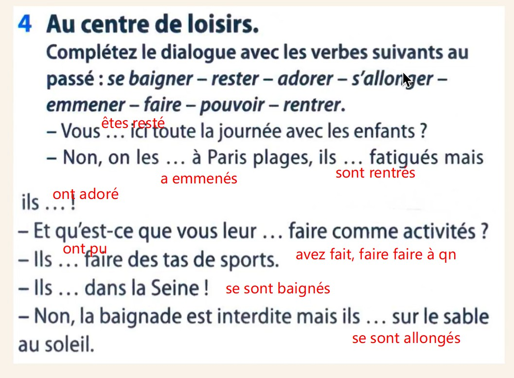
24. 
24. 
24. 

---

## 24.6.4 - 1

1. Il faut envisager toutes les éventualités 
   1. envisager le pire(the worst)
2. dessiner un paysage(draw)
   1. dessiner sur le vif 
3. chef de l'État(国家元首)
4. démarrer sa voiture(start his car)
   1. démarrer un travail(start to do a work)
5. Le chantier est interdit au public(building site)
6. critère de sélection(criteria)
7. modalité(（行为或思想的）方式，（事务的）形态)
   1. modalités de paiement
   2. L'école a l'obligation d'accueillir et de former, selon des modalités adaptées, les enfants handicapés 
8. La police a lancé les recherches(launch)
9. s'attaquer à un problème(谋求解决)
   1.  s'attaquer à un projet gigantesque 
10. inciter qn à inf 
    1.  Les idées proposées doivent permettre de trouver des moyens d'inciter les spectateurs de Paris et de banlieue(suburb) à se rendre au cinéma à Paris sans utiliser leur voiture individuelle 
    2.  La mort prématurée de son père l'a incité à choisir la profession de médecin 
11. se rendre 
    1.  se rendre à son travail
    2. La police s'est rendue sur les lieux 
12. apportez-moi ce livre 
    1.  Il nous apporte une bouteille d'eau
    2.  qualité de l'amélioration apportée
13. faisabilité de la solution(可行性) 
    1.  Notre groupe a bossé（加班） pendant un mois pour ce rapport de faisabilité 
14. ce dictionnaire contient(contenir, contain) plus de mille cinq cents page s de de soixante mille articles 
15. Les propositions doivent contenir au minimum une présentation de l'idée, ses avantages et les conditions de sa mise en place
16. La participation au concours se fait par l'intermédiaire du forum de cet article 
    1.  par l'intermédiaire de(通过。。。， 借助于)
17. mère de trois enfants dont l'un est asthmatique 
    
---

## 24.6.5 - 1

1. Que signifie ce mot?
2. 
2. 
3. vous souhaitez faire connaître ce concours
   1. you wish to let yourself know about this contest 
4. le hall d'accueil 
   1. hall d'arrivée 
   2. hall de départ 
   3. hall de gare 
5. date limite de remise(submit) des travaux
6. format(format) des travaux
7. Date d'attribution des prix(the attribution of the prise )
2. 
2. 
1. les décisions qui vont être prises dans le cadre des aménagements 
3. une tranche d'âge(一个年龄段)
4. indiquez ce qui caractérise(caractériser) la génération des quinquagénaires
   1. cet auteur caractérise bien ses personnages 
   2. les symptômes qui caractérisent une maladie 
5. les deux mots qui constituent(constituer) l'expression quinquattitude 
   1. les cinq anneaux constituent l'emblème des Jeux.Olympic 
6. Résumez en quelques mots ce article 
   1. summarize 
7. 

---

## 24.6.6 - 1

1. lâcher oiseau 
   1. L'art de vivre se résume à savoir quand s'accrocher et quand lâcher prise(何时坚持，何时放弃)
2. fou, foulle 
   1. Je suis tombée follement amoureuse d'un ami que je n'avais pas revu depuis vingt-trois ans 
3. Sa vie commence en août après un déménagement(move the house) qu'elle attend(anticipated)
4. . 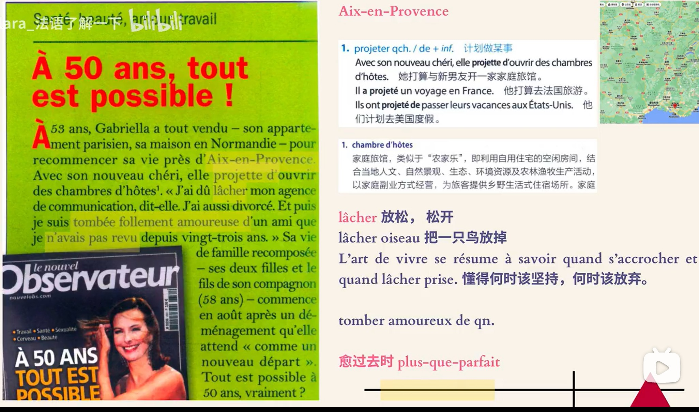
5. l'allongement de l'espérance de vie 
6. jouir d'une vie heureuse 
   1. jouir d'une bonne santé
4. 
4. 
5. le clown toujours se comporte drôlement
   1. se comporter 举止，行为
4. 
6. paraître plus ou moins vieux  
7. ce cadeau me plaît beaucoup 

---

## 24.6.7 - 1

1. La date du mariage a été repoussée  
2. 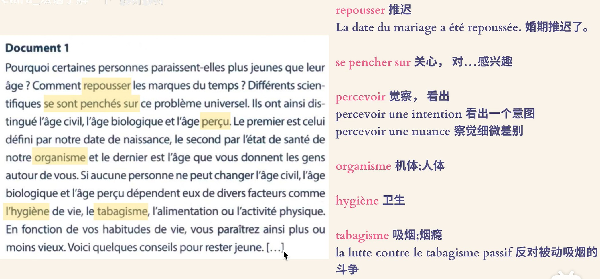
3. Avoir l'air plus jeune, d'accord, mais pas à n'importe quel prix 
   1. Avoir l'air(looks)
   2. Ces maisons ont l'air tout à fait neuves 
2. 
4. manger légèrement
5. pas question(out of question)
6. pas de question(no problem)
2. 
2. 
2. 
3. dans trois jours: 三天后
4. le slogan qui figure(appears) sous le logo
5. une somme de 300 euros 
   1. somme totale 
6. tirage 抽签，摸奖
   1. tirage au sort 抽签
   2. tirage d'une loterie 开奖
7. J'ai votre épouse en ligne (I have your wife online, 你老婆在给你打电话)
8. faire des travaux dans la maison(施工)
9. effectuer un placement(投资) financier 
   1.  placement à court terme 
   2.  placement sûr (安全投资)
   3.  palcement temporaire 
10. aider des proches(亲近的人)
11. Je suis riche, je me casse aux Bahamas 
    1. (me casser) leaving, going out of here 
12. ouvrier du secteur(field,领域) du bâtiment（建筑）
13. pour puisse accueillir des épreuves pendant les J.O 
14. 700 million d'euros ont été investis pour nettoyer La Seine 
15. À quels événements vas-tu assister?
    1.  assister à un événement visite
16. Les ouvriers sont en grève depuis dix jours 
17. Ça génère(generate) une aumentation des prix 
18. du travail bénévole(voluntary work)
19. Ils sont été expulsés(expulsion) vers d'autres villes 
20. tout les yeux sont braqués sur la France
21. J'ai du mal à voir autre chose que du positif 
    1.  avoir du mal à xxx
        1.  Les vagues sont trop fortes, les passagers du bateau ont beaucoup de mal à se tenir debout 
    2.  autre chose que(除。。外的别的。。)
        1.  Il n'a jamis fait autre chose que des bêtises 
        2.  J'aimierais qu'on parle d'autre chose que du travail 
        3.  Elle pense à autre chose que son examen 
22. Je peux dépenser sans compter
23. 
24. tout à coup l'orage se déchaîne 
25. gros, grosse 
    1.  gros appétit 大胃口
    2.  grosse averse  倾盆大雨
    3.  grosse somme 巨大的金额
26. Il travaille bénévolement

---

## 24.6.9 - 1

1. Je me lave le visage, je mets de la crème, je me brosse les dents 
2. Je me maquille(I make up )
3. Je vérifie que J'ai bien mes clés 
4. Elle descend dans six stations(she will get off in six stations) 
5. 0-30min est gratuit, au-delà(hereafter) 1 euro / 30 min
6. Le vélo est déverrouillé(unlocked)
7. Abonnez-vous à la chaîne
8. remporter(win) une grand succès 
9. mis à part ce voyage(except this voyage)
10. continuer à faire
23. 
23. 
23. 
23. 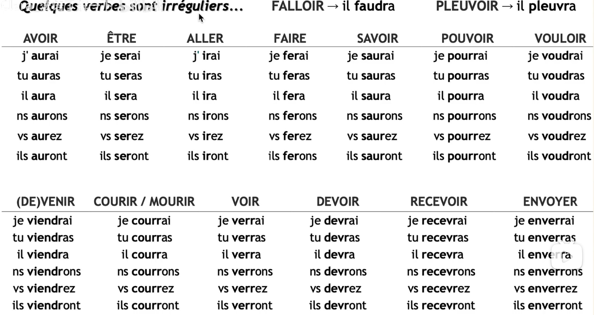
23. 
23. 
23. 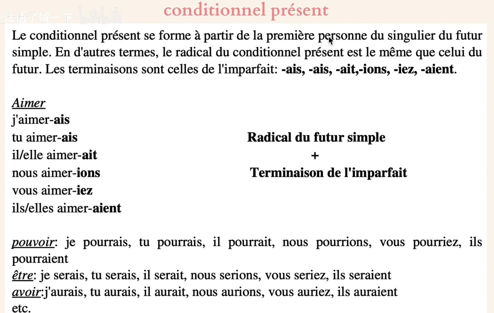
23. 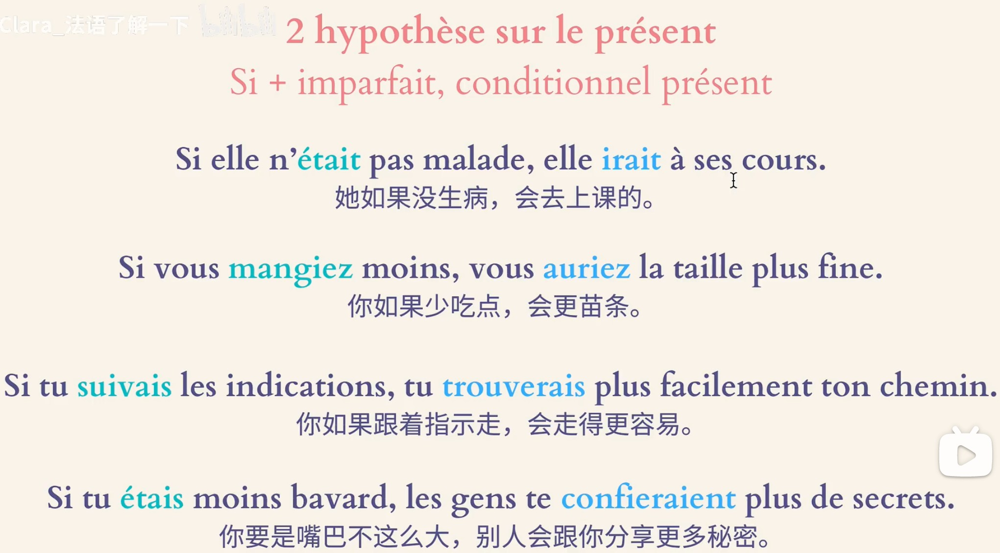
23. 
23. 
23. 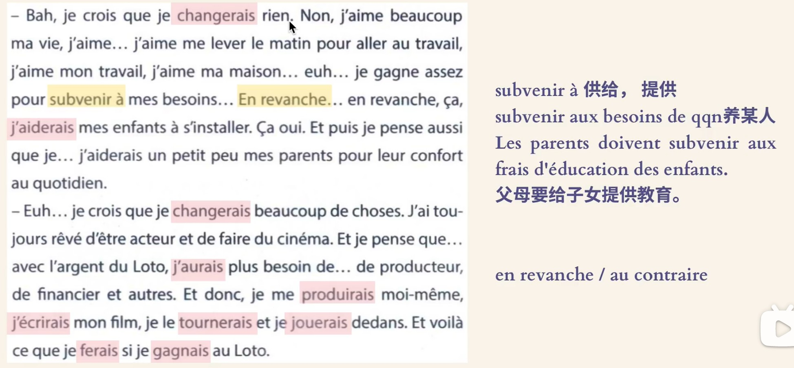
24. subvenir à(供给，提供)
    1.  subvenir aux besoins de qqn

---

## 24.6.10

25. 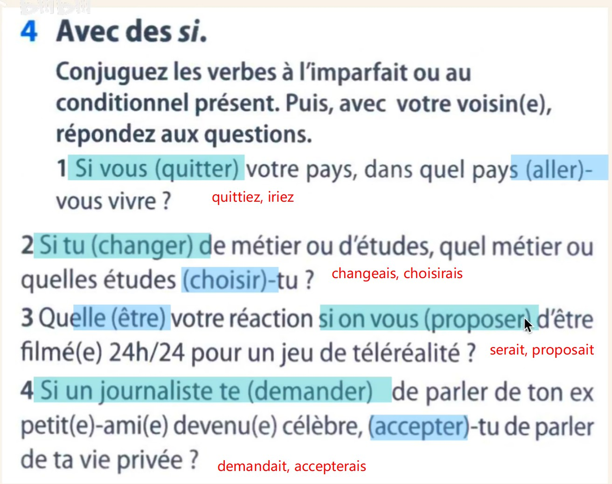
26. 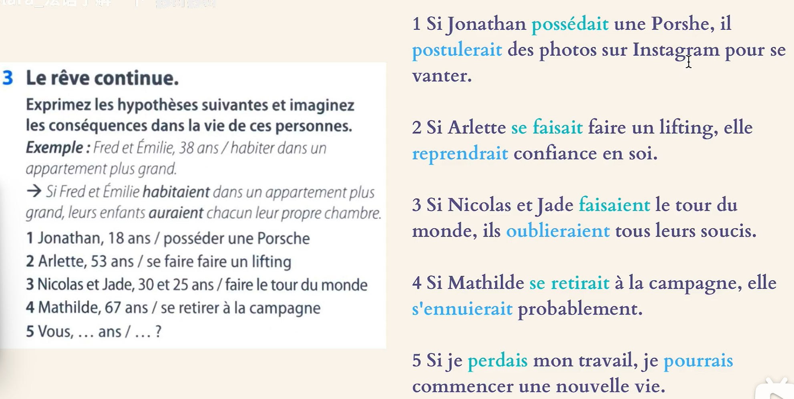
26. 
27. offir le gîte（住所） et le couvert(餐具) à qn
    1.  提供膳宿
28. implanter une entreprise 建立一个公司
    1.  entreprise qui s'implante à l'étranger 在国外建立公司
    2.  s'implanter 固定在，生长在
29. se faire connaître 被知道
30. Il s'est reconverti dans l'informatique 
    1.  改行从事信息技术
26. 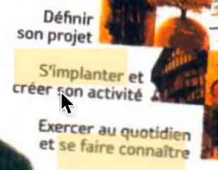
    1.  define you project
    2.  exercer au quotidien: to work on daily works
27. s'occuper de la décoration 
26. 
26. 
    1.  rural --- urban 
26. 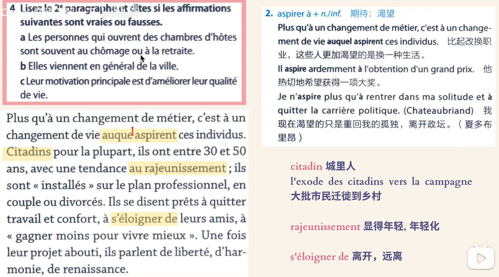
26. 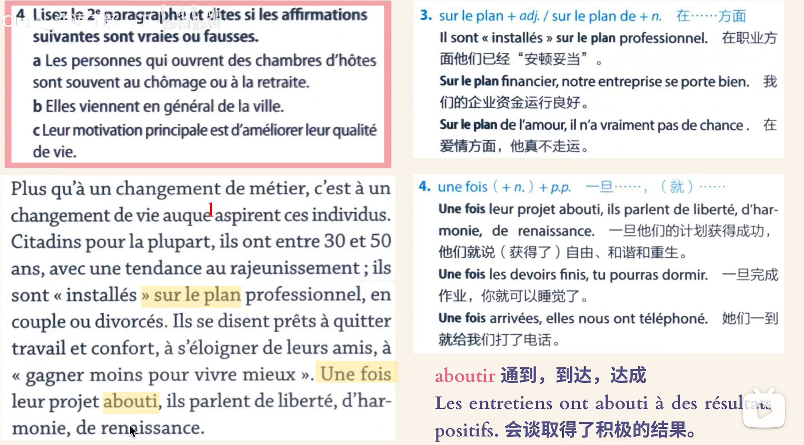
26. 
26. 

---

## 24.6.11

26. 
26. 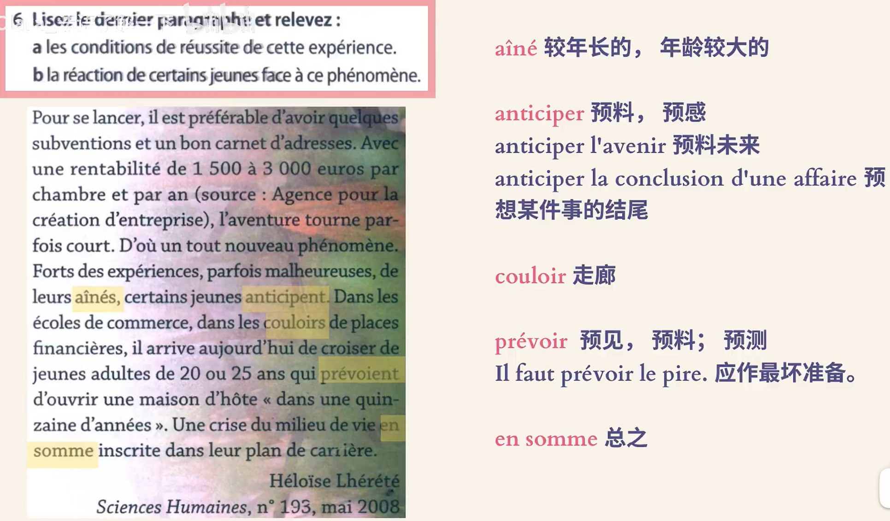
27. le protrait de la personne interrogée 
    1.  profil = portrait 
28. Si j'avais été propriétaire, J'aurais eu moins de charge(费用) à payer
    1.  loyer sans les charges  
26. 
    1.  propriétaire du bien(财产，特指不动产)
    2.  allègement 减轻
    3.  avec recul = in retrospect
26. 
26. 
    1.  c'était au-delà(beyond) de l'accueil dans cette maison 
26. 
26. 
26. 
26. 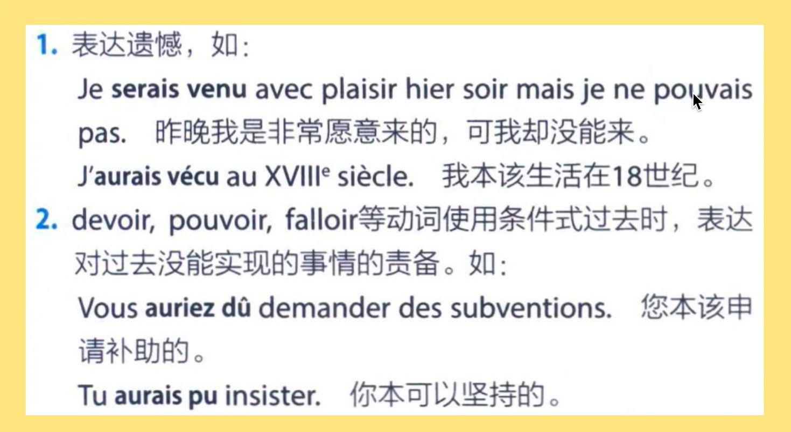
26. 
26. 
 
J'aurais y allé avec attention 
Il aurait dû rester là

Si il s'etait consigné avec plus des gens, sa maison d'hôtes aurait marché

Il n'aurait pas y habité

Si tu avais expliqué 

0:02 Elsa Kopf - Larmes de caramel

3:41 Andrea Lindsay - Les yeux de Marie

7:13 Mary L. - Parfum Perdu

10:30 Mary L. - Plage des Amoureux

14:09 Mary L. - Pleut Sur Rio

17:58 Stacey Kent - C'est le printemps

22:30 Stacey Kent - Jardin d'hiver

26:06 Stacey Kent - Les eaux de Mars

29:52 Elie Semoun - Au petit bonheur

33:18 Elie Semoun - Le secret

