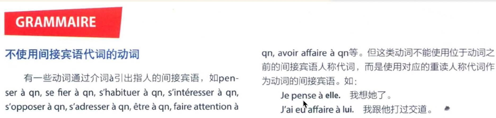

# lesson 1 

## masculine

| 1 | 2 |
| :---: | :---: |
| -o, -u | le vélo, le bureau, le munu |
| -age, -eau| le voyage, le château, le gâteau |
| -ment, -isme| le moment, le gouvernement, le tourisme|
| -s, -x | le bus, le prix, le choix |
| 季节，月份，星期，方向，数字| l 'été, le janvier, le lundi, le nord, le deux|

1. le ménager
2. le monde 
3. le obstacle
4. le example
5. le livre
6. le site 
7.  le programme 

## feminin

| 1 | 2 |
| :---: | :---: |
| -e | la table, la voiture, la musique |
| -ée | la clé, la poupée |
| -té, -tion | la liberté, la nation |
| -ure, -ie | la nature, la culture, la vie |
| coulour, fruit, plant| la pomme, la rose|

1. la cour
2. la cuisine
3. la maison

## vocabulaire

1. La cinquantaine 
2. agriculteur
3. veuf ou célibataire
    1. spouse passed away
4. travailleur
5. sérieux
6. inquiet
7. râleur
    1. always whining
8. agence matrimonial
9. petie
    1. short
10. chauve
    1. bold
11. aime regarder certains reportages à la télévision
12. fini les soucis
    1.  finie la cigarette
    2.  finies les vacances
13. l'une d'entre elles
14. un reportage
15. Pour A, xxxx et quant à B, xxxx

## 24.4.28 - 1

1. **s'informer** sur la personalité de quelqu'un
2. Je **participe beaucoup à** ce type de rencontre 

## 24.4.29 - 1

1. les adultes **actifs** (employed)
2. le prix **exorbitant** des loyers
3. **tenir le même discours** sur la consommation 

## 24.4.30 - 1 

1. faire les tâche ménagère (housework)

## 24.5.1 - 1

1. ne pas de s'exprimer en cas de désccord 
2. J'en avais assez de vivre seule 

## 24.5.2 - 1

1. **parfois**, en se mariant, les maris ne sont plus aussi **disponible** qu'avant
2. tenir des **propos(语言，话)** **déplacés**，(讲不合适的话)
3. il faut **tenir compte de**... (需要考虑。。。)
4. **partager** une pomme en deux par moitié
5. **partager** le travail entre des ouvriers 
6. **partager** l'opinion de qn (赞同某人意见)
7. sac **attaché** à la ceinture
8. les jeunes sont les moins **attachés aux** idées conservatrices 
9. Nons restons néanmoins **attaché à** ces objectifs 
10. **Pas question** de l'accepter (绝不 )
11. L'important, c'est de ne pas perdre de temps
    
## 24.5.3 - 1 

1. Nous amierions bien apprendre comment vous faites au quotidien.
2. Depuis combien de temps vivez-vous en colocation?
3. Ça fait longtemps que vous avez choisi ce mode de vie?
4. Est-ce que vous pouriez nous expliquer votre choix?
5. Comment vous organizez-vous? 
   1. En vivant en colocation, j'ai trouvé mon équilibre entre discuter avec mes amis et aller m'isoler dans ma chambre

## 24.5.5 - 1

1. la probabilité d'une **hypothèse**
2. cette hyposthèse est tout à fait vraisembable
3. payant vs gratuit
4. répondez les qustions oralement == répondez-y oralement
5. s'inscrire gratuitement == sign up for free
6. je desends le chien == walk the dog 
7. j'arrose l'plante == water the plants 
8. est-ce que je peuz vous renseigner? == can I help you?(give you some infation you need)
9. cette activité ne convient pas aux personnes âgées
10. si cela vous convient
11. ce livre convient à ses goûts 
12. cette colle(glue) convient à toute sorte de matériaux
13. le climat méditerranéen couvient à l'habitation des humains 
14. s'occupe 照顾，照料
    1. c'est mon mari qui fait la cuisine, je m'occupe de la vaissele(wash the dishes)
    2. . Elle s'occupe d'un club de sport
    3. Je vais m'occuper de ce problème 
    4. Il ne s'occupe pas de affaires des autres
15. Edmond sera capable de s'en sortir(摆脱困难), Nous avons confiance en lui
16. Je me sens capable de vaincre n'importe quel obstacle
17. Il est capable de se fâcher pour un rien
18. Passionée de petite voitures, elle en a toute une collection
19. deux matinées par semaine
20. ces jeunes garçons sont passionnés du football, ils jouent au football une fois qu'ils finissent le travail
    1.  une foi que == as soon as  
21. une personne âgée

## 24.5.13 - 1

1. l'espace(le milieu, la sphère) privé
   1. 空间
2. apportez-moi ce livre
   1. apporter une nouvelle

## 24.5.14 -1

1. vous êtes **sur le point de** tout quitter
2. vous souhaitez de quitter votre emploi pour consacrer à vos enfants 
3. zéro un dexu trois quatre cing six sept huit neuf dix 
4. onze douze treize quatorze quinze seize dix-sept dix-huit dix-neuf
5. vingt trente quarante cinquante soixante soixante-dix quatre-vingt quatre-vingt-dix
6. En quoi votre profil peut nous intéresser（在哪些方面）
7. se fâcher sans motif
8. donnez-moi vos coordonnées(联系方式，地址)
9. se fâcher sans motif
   1.  le motif de mon retard
10. prendre congé de qn(向某人告辞)
11. laissez votre e-mail pour que nous puission vous joindre facilement
12. J'ai suggéré qu'on aille les voir
    1.  suggest
13. des information **concernant** nos émissions
14. Merci d'avance
15. je vous serais reconnaissante de m'adresser les coordonnées
    1.  être reconnaissant à qn de qch

16. 
17. 
18. 
19. 

20. Isabelle
    1. Qu'est que l'âge de votre enfants?
       J'ai cing enfants, mon fils aîné a 25 ans, il a obtenu son diplôme il y a trois ans. Ma plus petite fille a 15 ans, elle est encore au lycée
    2. Pourquoi voulez-vous rependre une activité professionelle et quelle activité professionelle vous a décidé de rependre?
       1. J'ai quarente-huit ans et j'ai quitté mon activité professionelle il y a vingt-cinq ans quand je était pragnent et même si j'avait obtenu mon diplôme de langue étrangère. Pendant ce vingt-cinq ans, j'ai appris mon fils et mon fille la langue étrangère, chinoise, donc, je n'ai la pas encore oubliés. Et maintenant, puisque mes enfants étaient grand, je peux consacrer mon temps on activité professionelle de une professeur de chinois, laqueele est mon rêve. 
    3. Quelles etaient les réponses de vos enfants et votre mari?  
       1. Mon enfants et mon mari soutiennent ma décision, parce que c'est bien financièrement pour notre famille, et surtout, c'est mon rêve depuis longtemps
    4. Avais vous trouvé un emploi maintenant et est-ce que vous pensez que il y a des discrimination cherchant un emploi?
       1. J'ai déja trouvé un emploi parce que il n'y a pas beaucoup de professeur chinois dans la France et l'âge n'est pas un grand obstacle pour trouver un emploi qui demande une expertise , je pense. Alors, je ne pense pas que j'ai rencontré des discrimination quand je était en train de trouver un emploi

---

## 24.5.16 - 1

1. Et vous, qu'en pensez-vous? 
2. Vous voulez rajouter quelque chose?
3. Si j'ai décidé de quitter mon emploi, c'est que je suis encore jeune
4. Vous n'allez pas le regretter
5. Je suis entièrement d'accord avec vous
6. Absolument
7. ouvrez à tout âge les portes de la formation
8. une tranche de pain 
9. dès que 
   1.  une fois que 
   2.  à chaque fois que 
   3.  au moment où
10. cette rencontre m'a laissé un souvenir inoubliable
11. les relation internationales en licence 
12. cette qustion appartient à la philosophie
13. tirer la leçon des erreurs
14. D'autres délégations se sont déclarées **hostiles à** cette proposition(反对)

---

## 24.5.17 - 1

1. Il **confond** la droite et la gauche
   1. confondre
2. Elle a beaucoup compris au cours de de son voyage
   1. au cour de(在。。。过程中)
3. rendre compte de, rendre compte que
   1. Après une longue discussion, en général je me rends compte que ma femme a raison
4. tenir compte de 
   1. mais, c'est ennuyeux qu'il ne tient jamais compte de l'avis des autres
5. un peu partout en France
6. être plein d'indulgence **envres** les enfants
7. il trouve un peu injuste **envres** son ami
8. elle **garde** de ce séjour à l'étranger un excellent souvenir(leave her a valueable memory)
9. en âge scolaire

--- 

## 24.5.18 - 1

1. 
2. 
3. 
4. 
5. 
6. 
7. 
8. 
9. 
10. faire appel à la main d'oeuvre étrangère
    

---

## 24.5.20 - 1

1. À compter du 1998 (from 1998)
2. c'est une website official qui décrit les démarches pour devenir acquérir nationalité français 
3. on est majeur \ on est mieur (be of age \ under-18s)
4. 
4. 
4. 

--- 

## 24.5.21 - 1

1. 
2. 
3. 
4. 
5. 
6. 
7. l'action entreprise par cet organisme( action adopted by this oragnaization )

---

## 24.5.23 - 1

6. 
1. Désormais, .... (from now onsss)
2. ancien camarade(ancien名词前，前任的，往届的。。。， 名词后，表示旧的)
3. une agence immobilière
4. prenons le cas de Lionel(take ... as a example)
5. 
6. 
6. 
6. 
6. 
6. 
6. 
6. 
6. 

---

## 24.5.24 - 1 

6. 
7. des erreurs commises(commettre)
6. 
6. 
6. 
6. 
6. 
6. 
6. 
 

---

## 24.5.25 - 1 

6. 
   1. fourré = filled
   2. garçons dans le vent == in fashion
6. 

---

## 24.5.27 -1 

6. 
   1. autant de fois que vous voulez 
6. 
6. 
6. 
6. 
6. 
6. 

---

## 24.5.28 - 1

1. repérer une faute dans un texte 
2. repérer les information qui figurent déjà sur le site 
3. retrover les énoncés qui répondent aux questions suivantes 
   1. énoncé : 陈述
4. J'écoute de la musique soul, vous vous souvenez peut-être justement de ce succès de Françoise Hardy
   1. se souvenir: 回想
5. sans cesse 
6. ça n'empêcher pas d'émailler(美化) ses chansons de clins d'oeil à son pere 
7. il en a fait son métier 
   1. faire de xxx son métier: take xxx as one's career 
8. il a enchaîné les tournées de concert
   1. enchaîner: 接连展开
9. ses amis musiciens rencontrés en Corse 
   1.  the friends he met 
10. Il laisse des traces de pas sur la neige
11. sons fils Thomas, qui excelle dans un tout autre genre 
12. 
13. 
    1.  Il y a participé: 因为意思不同与（il y a，有 ）不同，注意发音，il y, a 
14. 
15. effectuer un paiement 
    1.  effecture une promesse
16. établissement hospitalier 
    1.  établissement public 
    2.  établissement scolaire
17. le taux de réussite national atteint l'an dernier
    1.  atteindre le but 
    2.  atteindre le niveau mondial d'avant-garde
18. des lycéens qui ont échoué
    1.  Il est triste d'avoir échouer 
19. Nous nous attendons à une récolte abondante cette année 
    1.  s'attendre 预想，预料
    2.  Ils ne s'étaient pas attendus à vous voir 
20. la foule s'agglutinait devant les grilles 
    1.  s'agglutiner （gathering， glued together）
21. ils sont soulagé d'avouvé sa faute 
    1.  Le médecin lui a prescrit un remède qui l'a bien soulagé 
    2.  soulagé 轻松的
22. gâcher les vacances = spoil, ruin 
23. Elle a raté sa pizza = she made a mess of her pizza
24. il pleut des cordes(it rain heavily)
25. Je suis trempé == I'm soaked
26. le chômage a diminué par rapport à l'an passé 
27. Mais il y a également les élèves qui sont admis aux épreuves de rattrapage 
    1.  être admis à, 被接纳
28. anticiper la conclusion d'une affaire 
29. se faire recaler(to fail, or 考试不及格)
30. Soulevex le dictionnaire, le manuel est en dessous 
    1.  ce vêtement est fait pour se mettre en dessous 
31. un entretien qui dépasse dix minutes 
    1.  Il a dépassé la trentaine
32. cette colle **convient à** toute sorte de matériaux
33. La vérité **finira par** se dévoiler
34. par palier 分阶段
    1.  procéder par palier 
35. ranger des objet par séries
    1.  série 类
36. Il nous faut tenir compte de l'opinion des parents avant de faire quoi que ce soit  

---

## 24.5.29 - 1

1. la chanson française est au programme du bac 2009
   1. au programme 在课程中
2. bulletin scolaire 成绩单
   1. bulletin statistique 统计公报
3. des artistes retenu 
   1. retenir 采纳，接受
4. plancher sur (ponder over)
5. Il fait un temps épatant
   1. 口语，好极了
6. un pont à deux piles 
7. leur nombre est suffisamment significatif pour qu'une prof de musique  
8. les élèves se pécipitent sur l'option
   1. ici, pécipiter = hâter
9. 
9. 
   1.  法语 supporte = 英语 put up with 
   2.  法语 soutenir = 英语 support
   3.  contestataire = controversial 
   4.  engagé = care about things like environment, polictis, life ....
   5.  dépassé = outdated 
10. Le carnaval de Nice se déroule en février 
    1.  se dérouler 开展
11. Où  peut-on se procurer ce livre 
12. en bus, voiture, train, plane 
    1.  à pied, à vélo 
13. 
13. 
13. 
14. Des moniteurs encadrent les enfants 
    1.  encadrer 管理
15. solution pratiques

---

## 24.5.30 - 1
 
1. 
2. Terrain d'accueil provisoire(temporary)
3. consigne gratuite(left luggage )
4. cette formule comprend 3 nuit en hôtel 3 étoiles avec 3 petits déjeuners 
5. Il habitait dans un village proche 
6. voyager à tarif réduit(reduced fare )
   1. à plein tarif(full price )
7. les assurance facultatives (optional)
8. les autres repas et les boissons(meal and drink)
9. les dépenses d'ordre personnel
   1.  d'ordre + adj 属于某一类的
1. 
   1. alors que = however
2. Des moniteur encadrent les enfants 
   1. encadrer = manage 
1. 
2. il n'a jamis entendu parler de cette chanteuse 
   1. never heard about 
3. J'ai un rhume (I have a cold)
4. obliger qn à faire 
5. on va quand même évoquer des artistes en France(we still have to mention about ...)
6. elle affiche(montrer) déja une maîtrise(精通) vocale étonnante 

---

## 24.5.31 - 1

7. 
8. elle vit à Paris aujourd'hui
7. 
7. 
7. 
7. 
   1. grouillant = swarming with 
7. 
7. 
7. 
7. 
7. 
7. 
7. 
7. 
7. 
   1. des voiture aura considérablement diminué

---

## 24.6.1 - 1

1. le jardin des couleurs captives 
   1. captivate
2. un problème facile à comprendre
3. quitter la grisaille(阴沉) pour se retrouver dans cet endroit agréable à visiter 
4. institutrice, instituteur dans une école(小学)
5. J'ai entendu parler de votre festival
6. des guids adaptent(adapt) les dicours en fonction de l'âge des enfants 
7. Il faut compter plusieurs heures pour faire cela 
8. dites-moi en ce qui concerne pour manger
   1. en termes de pour manger 
   2. about
9. par contre(conversely )
   1.  par contre, vous pouvez choisir cela 
10. un château en libre accès(free access)
11. l'ensemble des scolaires 
    1.  group of students
12. deux jours à l'avance
    1.  prévenir qn à l'avance 
    2.  Tout a été préparé à l'avance
    3.  réserer à l'avance 
13. prévoir un changement de temps(预料，预测天气变化)
14. domaine de château de Versailles(park of ...)
15. Neuf virgule cinquante(9.5)
16. avoir un horaire chargé(have a tight schedule)
    1.  Horaires et tarif sur www.xxx
17. indiquer la sortie à qqn(indicate the exit to someone)
18. une cuisine inventive(innovative) et raffinée(refined) conçue(convevoir) autour de théme du festival 
    1.  Elle a préparé un certain nombre de mets raffiné
19. situé à proximité du château = a côté du château 
20. Pâtes(noodles) fraîches et sauces à volonté(all you like)
21. Aujourd'hui, le gâteau symbolise le partage et la convivialité
22. métier artisanale(手工行业)
    1.  glaces artisanale(handmade ice-cream)
23. ouverture de 12h à 15h (open at ....)
24. Le centre de formation propose des formation ouvertes à tous(here formation means training )
7. 

---

## 24.6.2 - 1

7. 
7. 
7. 
8. Notre objectif est de construire un supermarché dans ce vieux quartier 
9. La satisfaction du client est notre objectif 
10. Merci encore de ton engagement dans cette opération(activity)
11. 
11. 
    1.  bosser = travail, oral 
12. s'informer = se renseigner 
13. se baigner pour se rafraîchir 
    1.  mettre du vin à rafraîchir 
    2.  se fraîchir (make oneself cool, have cold drinks )
14. se faire masser 
15. se faire couper les cheveux chez le coiffeur
16. déclarer ses intentions à qn 
    1.  Je déclare que je n'accepterai aucun compromis 
    2.  Il ne veut pas se déclarer sur ce point(发表意见)
17. David a enfin osé m'aborder
    1.  aborder 靠近，上前交谈
18. Nous nous sommes donc retrouvés devant l'entrée du métro(约定在。。。见面)
19. oser poser une question 
    1.  il n'ose pas dire 
20. cela compte beaucoup(this is important)
21. . 
22. Il est assis sur le canapé
    1.  asseoir
23. Vous avez eu mal ici auparavant(您这里之前疼过吗)
24. 

---

## 24.6.3 - 1

24. 
24. 
24. 
24. 
24. 
24. 

