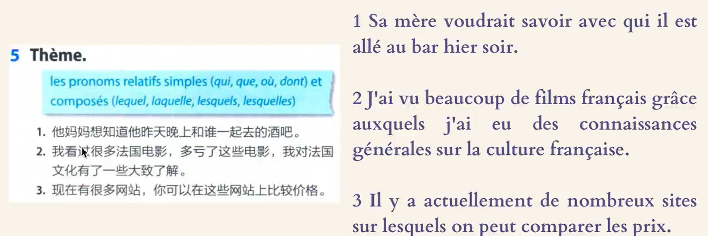
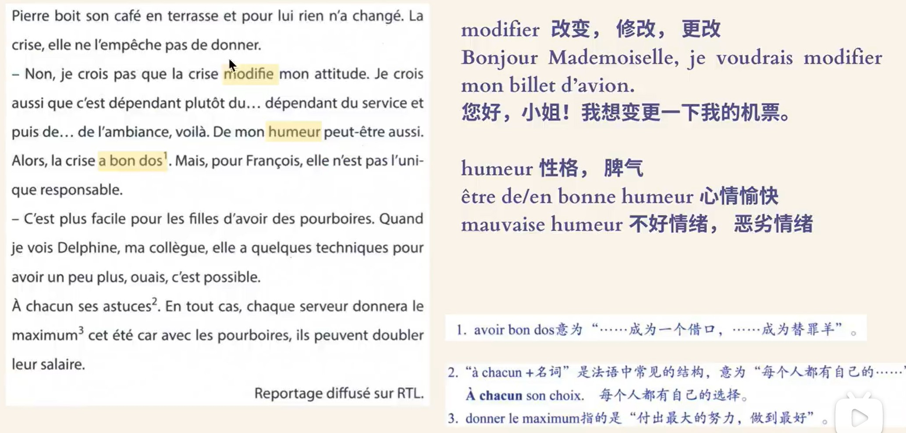
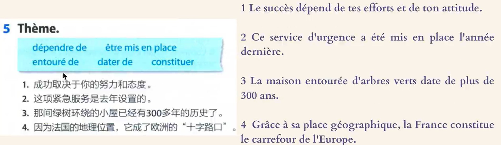
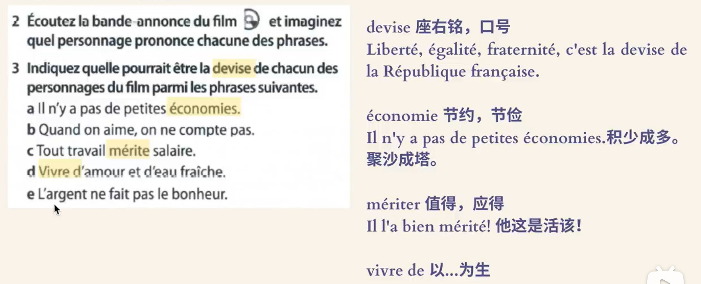
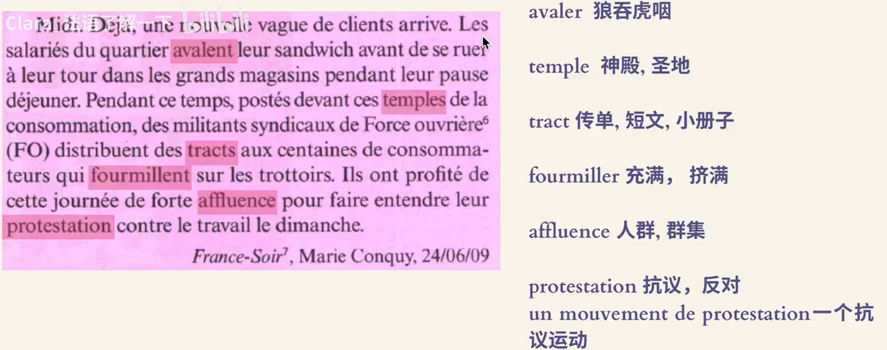
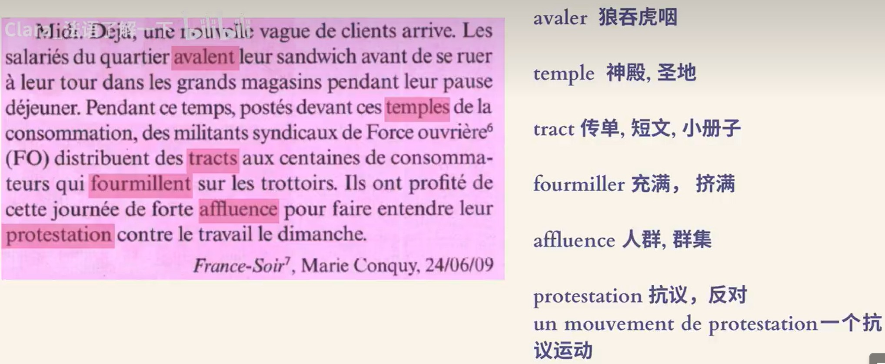
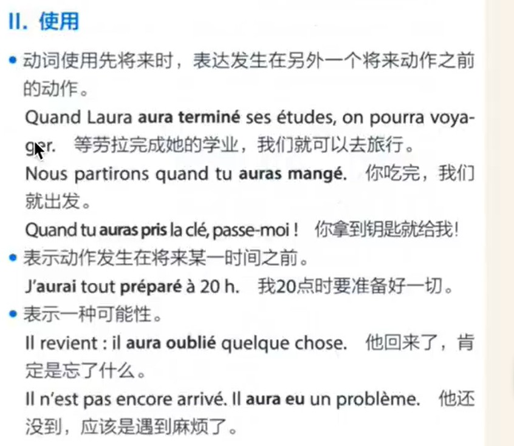
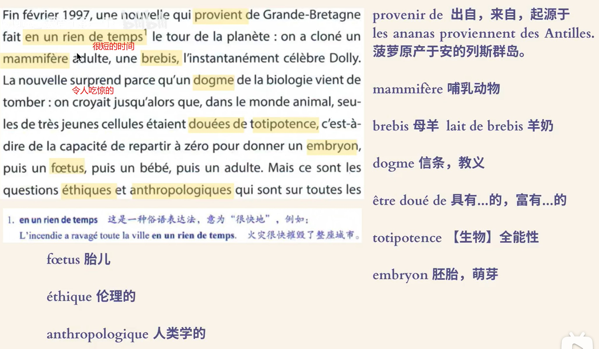
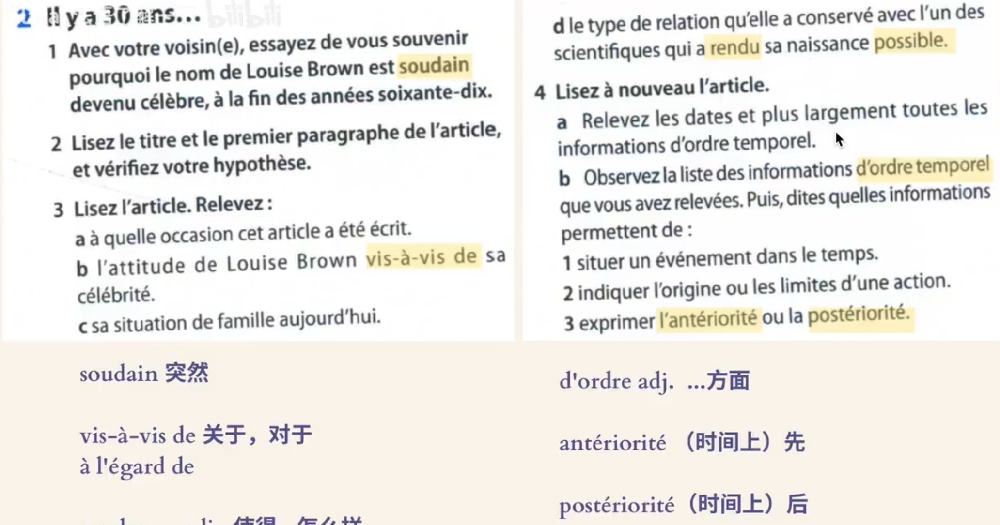
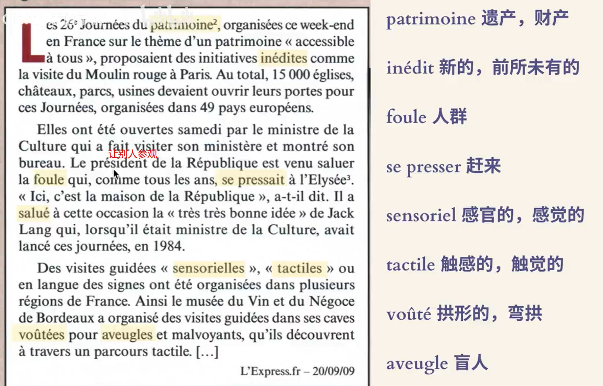

---

## 24.7.1 

1. évoquer 
   1. évoquer un problème : 提及一个问题
2. inconvénient 
   1. avantages et inconvénients de qch
   2. quels sont les inconénient de ce métier?
   3. L'inconvénient de cet appraeil réside dans son prix : 缺点在于其价格
1. 
   1. livrer : deliver
   2. vu l'heure : 鉴于
1. 
1. 
2. Voici le bateau à bord duquel j'ai traversé le fleuve
1. 
2. Demandez votre code de client privilégié grâce auquel vous pourrez bénéficier de traifs promotionnels très intéressants 
3. Ce site d'articles électroménagers dispose d'un service  après-vente
4. Je commande tous mes billets d'avion aupràs de cette agence 
   1. commander : order
5. Je peux effectuer des paiements sécurisés sur ces sites 

---

## 24.7.2 

1. 
1. 
1. 
1. 
   1. en gros : in general
   2. moitié moins : half less
1. 
2. On pense que la pratique du pourboire est née en Angleterre 
3. L'objectif initial était d'encourager l'amabilité des serveurs 
4. Cette pratique est arrivée plus tradivement(very late) en France 
   1. rentrer tardivement : back home very late 
5. actualité = current events 
1. 

---

## 24.7.3

1. 
   1. versé: 此处可以理解为“给”
1. 
1. 
   1. facture : 账单，发票
   2. montant : 金额 
1. 
1. 
   1. Grâce à ： 因为（好的）
   2. à cause de : 因为（坏的）
1. 
1. 
1. 
   1. arriver pas à quel'ch : 做不到。。。
2. fou --> folle --> n. foli
3. lisez le chapeau(报刊杂志的文章简介) : read the introduction
4. Parisiens à la recherche de bonnes affaires(a good value ) 
1. 
   1. l'aube : sun rise 
   2. accro:  addict
1. 
1. 
   1. déçus : disappointed 
   1. découragés : disappointed 
1. 
   1. se ruer : like se pécipiter, se presser , 涌入
1. 

---

## 24.7.6

1. Le gouvernement signe cet après-midi un accord afin de revaloriser le salaire de base dans la fonction publique(cival servent)
2. Forte diminution du pouvoir d'achat des français au cours des douze derniers mois 
1. 
   1. avoir envie de 
2. convaincre à tout prix 
   1. convaincre qn de inf. 
1. 
1. 
1. 
   1. sous sept jour : in seven days 
2. faire le protrait des personnes susceptibles d'être intéressées par ce type de produit 
   1. susceptible de faire: possible to do 

---

## 24.7.7

1. qui porte une tenue ostentatoire destinée à montre la richesse
2. Souris d'orinateur (mouse)
3. ces appartements sont très mal conçus : these flats are very badly designed 
1. 
1. 
1. 
1. 
1. 
1. 

---

## 24.7.8

1. 
   1. dans la foulée : immediately afterwards 
2. 
   1. solliciter : appeal 
2. 
3. La généralisation de ces moyens de communication est-elle dangereuse pour notre vie privée?
   1. la généralisation d'un conflit 
   2. La généralisation de l'usage d'Internet permet l'e-gouvernment 
   3. généralisation : 推广，普及，扩大
4. le téléphones protable = le protable 
5. <mark>partique</mark> 方便的，不要说convinient
2. 

---

## 24.7.9

1. la **vedette** d'une série-documentaire
2. l'objectif du document dédié à Homeward
3. 
   1. en permanence : 持续的，一直
3. 
3. 
3. 
3. 
   1. espionner : espionage 
3. 
   1. permanence : le caractère
   2. bouleversement : big change 

---

## 24.7.10

1. Pourtant, depuis deux jours, les internautes se délectent devant une séquence filmée à l’insu du prince de Galles et qui pourrait bien devenir culte. Sur cette vidéo amateur, on voit l’époux de Kate Middleton, lunettes de soleil vissées sur le nez, circuler au château de Windsor à vive allure sur une trottinette électrique. De quoi mettre en émoi les réseaux sociaux. «C’est notre prochain roi, au fait», s’amuse à souligner un internaute cité par US Weekly . Tandis qu’un autre renchérit : «Je ne savais pas qu’il était aussi détendu.»
3. 
4. un défi à relever 
   1. a challenge to accept, to take up 
5. repérer le non de l'association et son slogan 
   1. repérer : 发现， 认出，辨别，区分
3. 
   1. trier des déchets: 垃圾分类
   2. préfèrer une douche au bain : prefer douche than bain 
   3. surchauffer : overheat 

---

## 24.7.11

1. 
   1. échelle individuelle : 个人层面上    
   2. ce
1. 
   1. se rappeler : 提醒
1. 

---

## 24.7.12 

1. 
   1. carnet : notebook 
1. 

---

## 24.7.13

1. 
1. 

---

## 24.7.14

1. décrivez la photo et le dessin 
   1. describe  
2. J'exige que cette loi garantisse mon droit et ma liberté à produire et à consommer sans OGM 
1. 
   1. un couvert : 一套餐具
2. les interrogations que ce phénomène a soulevées 
   1. soulever une question 
   2. Depuis des anées déja, je soulève cette question dans des réunions 
1. 
1. 

---

## 24.7.15

1. Trois mois plus tard, elle découvre que son cancer s'est étendu. Pourtant, en avril 2017, survient la délivrance : Shannen Doherty est enfin en rémission. La rechute tant redoutée se produit en 2019. C'est sa chienne Bowie qui, la première, donne l'alerte. Le berger allemand ne cesse de renifler la zone dans laquelle le cancer de sa maîtresse s'est propagé. L'actrice vit alors un véritable ascenseur émotionnel.
2. 
2. 
2. 
2. 
2. 

---

## 24.7.16

1. elle relève un autre défi de taille
2. 
3. l'ère du numérique 
   1. la époque 
4. le pays ou il a été conçu 
   1. concevoir 
2. 
   1. truc : 小玩意
2. 
2. 
2. 

---

## 24.7.17

1. Rain Carradine est née dans une colonie minière où les ressources viennent à manquer et où les populations triment.
2. Quand je suis devenue actrice, j'ai rattrapé beaucoup de films célèbres, dont les épisodes d'Alien, références absolues du film de monstre.
3. j'ai quitté l'école à 13 ans. Mon horizon n'était pas radieux. Jouer a été ma planche de salut : j'ai commencé par chanter à l'église avant de faire du théâtre 
4. Je suis fière du chemin parcouru et de la vie que j'ai réussi à construire.
5. Confidences, messages échangés jusqu'à la nuit tombée, regards langoureux trahissant leur attirance
2. 
2. 
3. le télétravail permet de développer des contacts **au sein de** l'entreprise
   1. 在。。。中
4. le télétravail suppose d'être dans une région très bien équipée **du point de vue** numérique 
   1. from the perspective of 
5. le télétravail ne **requiert** pas d'attention particulière 
   1. requérir : require 
2. 
2. 
   1. salarié : workforce
2. 

---

## 24.7.18

1. Il ne tarit pas d’éloges sur la jeune employée. He’s full of praise for the new employee.
2. 
3. 
4. le rentrée des classes est le 1er septembre 
5. première séance dans une salle de cinéma 
   1. séance : 一场，一次
6. ces résultats montrent une hausse du taux de fréquentation des salles de cinéma 
   1. hausse : augmentation 
7. les résultats annoncés portent sur l'ensemble de l'année 
   1. porter sur : 落在

---

## 24.7.20 

1. 
2. 
2. 
2. 

---

## 24.7.21 

1. 
2. elle ne pleure pratiquement jamais 
   1. pratiquement : in fact 
   2. pratiquement, à cause des embouteillages, il faut trois heures pour y aller 
1. 
1. 
2. On m'a prévenu de faire attention aux pickpockets dans le métro
   1. prévenir : remind 
3. il m'a appris qu'il partiait vivre à l'étranger 
1. 

---

## 24.7.22

1. 
   1. la veille : the previous day 
   2. le lendemain : the following day 
2. La voiture ne démarre pas mais je ne comprends pas pourquoi 
3. Qu'est-ce que tu faisais quand je suis arrivée ? 
4. 
5. un monde à part 
   1. à part : 特别的，特殊的， 分开的，单独的，除了
   2. un homme à part 
   3. occuper une palce à part 
   4. À part lui, nous ne connaissons personne ici 
6. un cimetière 
4. 

---

## 24.7.23 

1. La plupart des expositions sont tellement ennuyeuses que plus personne n'a envie de les voir 
2.  Le fait d'obliger les enfants à visiter ces musées entraîne inévitablement un rejet de leur part 
    1.  rejet : 抛弃，排斥
    2.  entraîner : 招致，引起
4. 
4. 
5. Dites quelle réaction provoque sa remarque sur les musées 
   1. remarque : 意见，观察
4. 
5. c'est difficile de se concentrer sur une œuvre 
6. Le prix d'entrée reste élevé, ce qui entraîne une baisse de fréquentation 

---

## 24.7.24

1. 
2. décrivez l'affiche 
   1. describe 
3. les actions mises en place pour rendre la culture accessible à tous 
   1. mettre en place = réaliser = effectuer
1. 
1. 

7. Elle est peureuse, une petite fourmi suffit de faire elle à pleurer 
8. Hier il m'a prévenu que il avait vu cette film, mais il allait le voir à nouveau
9. Il m'a dit que il me connaît, mais je ne me souviens pas de l'avoir vu

---

## 24.7.25

1. Il y a quelque chose chez la femme français 
1. 
1. 
1. 
1. 

---
## 24.7.26

1. 
2. À qui est cette magazine dstiné 
3. qulle est sa périodicté 
4. les thèmes abordés (涉及)
   1. J'ai très peu de temps, si bien que j'aborderai seulement deux sujets 
5. initiation (启蒙)
   1. Le joujou(toy) est la première initiation de l'enfant à l'art 
6. initier
   1. initier(传授) qn aux secrets d'une affaire 
   2. s'initier à qqcn (learn by oneself)
1. 

## 23.7.28

0. Il était une fois : once upon a time 
1. L'histoire des chefs-d'œuvre dévoilée 
   0. dévoiler : reveal 
2. Une énigme à résoudre(solve) et des numéros du Petit Léonrad à gagner 

---

## 24.7.30

1. 

0:02 Elsa Kopf - Larmes de caramel

3:41 Andrea Lindsay - Les yeux de Marie

7:13 Mary L. - Parfum Perdu

10:30 Mary L. - Plage des Amoureux

14:09 Mary L. - Pleut Sur Rio

17:58 Stacey Kent - C'est le printemps

22:30 Stacey Kent - Jardin d'hiver

26:06 Stacey Kent - Les eaux de Mars

29:52 Elie Semoun - Au petit bonheur

33:18 Elie Semoun - Le secret

