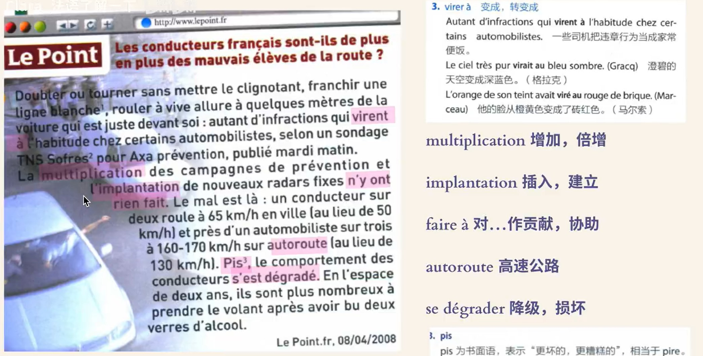

---

## 24.8.2 

1.  
2.  
3.  
4.  
5. de quel type de campagne s'agit-il ?
   1. campagne : 非商业广告
6. une personne courtoise : adj 礼貌的
   1. un geste courtois 
7. courtoisie : n. 礼貌
   1. leurs relations se bornent à la courtoisie 礼仪之交
8. les européens les plus polis au volant 
   1. au volant : 驾驶中
9. ceux qui conduisent le plus mal 
   1. apprendre à conduire 
10. en revanche = au contraire 
11. pas ... pour un sou : 一点也不
   1. pas modestes pour un sous, les Français se jugent à 93 pourcent bons conducteurs 
   2. il n'est pas méchant pour un sou 
12. les informations qui contredisent l'opinion que les conducteurs français ont d'eux-mêmes 
    1.  contredire : contradict 
    2.  ses actes contredisent ses paroles 
13. 

---

## 24.8.3

1. Doubler ou tourner sans mettre le clignotant
   1. clignotant: the light you turn on when swerving left or right 
2.  
2.  

---

## 24.8.4

1.  
1.  
1.  
1.  

---

## 24.8.5

1.  
2.  
2.  

---

## 24.8.6

2.  
2.  
2.  

---

## 24.8.7

2.  
   1. accroître : increase 
2.  
2.  

---

## 24.8.8

2.  
2.  

---

## 24.8.9

2.  
   1. vol : plane 
   2. veille : the previous day 
   3. animer : preside
   4. annuler : cancel
2.  

---

## 24.8.10

1. Apportez-moi ce livre 
2. apporter un élément nouveau à l'enquête 
   1. 给一份调查提供新的要素

---

## 24.8.11

2.  
2.  

Même si nous avons fait déjà de grand progrès, notre travail ne se termine pas pour autant 

Tu a eu 14 sur 20 cet examen , is ressort que tu n'es pas stupide 

La plupart des Français vont au bord de la mer ou à la compagne pour les vacances d'été

Pour participer cet compétition, il a fait beaucoup d'efforts 
