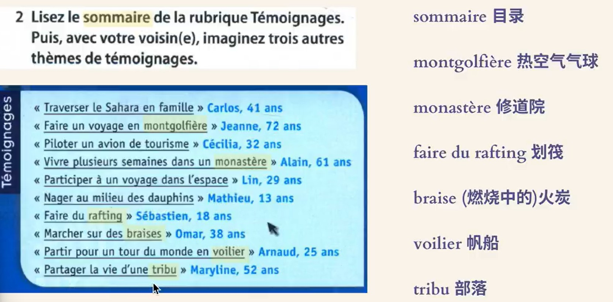

---

## 24.8.2 

1.  
2.  
3.  
4.  
5. de quel type de campagne s'agit-il ?
   1. campagne : 非商业广告
6. une personne courtoise : adj 礼貌的
   1. un geste courtois 
7. courtoisie : n. 礼貌
   1. leurs relations se bornent à la courtoisie 礼仪之交
8. les européens les plus polis au volant 
   1. au volant : 驾驶中
9. ceux qui conduisent le plus mal 
   1. apprendre à conduire 
10. en revanche = au contraire 
11. pas ... pour un sou : 一点也不
   1. pas modestes pour un sous, les Français se jugent à 93 pourcent bons conducteurs 
   2. il n'est pas méchant pour un sou 
12. les informations qui contredisent l'opinion que les conducteurs français ont d'eux-mêmes 
    1.  contredire : contradict 
    2.  ses actes contredisent ses paroles 
13. 

---

## 24.8.3

1. Doubler ou tourner sans mettre le clignotant
   1. clignotant: the light you turn on when swerving left or right 
2.  
2.  

---

## 24.8.4

1.  
1.  
1.  
1.  

---

## 24.8.5

1.  
2.  
2.  

---

## 24.8.6

2.  
2.  
2.  

---

## 24.8.7

2.  
   1. accroître : increase 
2.  
2.  

---

## 24.8.8

2.  
2.  

---

## 24.8.9

2.  
   1. vol : plane 
   2. veille : the previous day 
   3. animer : preside
   4. annuler : cancel
2.  

---

## 24.8.10

1. Apportez-moi ce livre 
2. apporter un élément nouveau à l'enquête 
   1. 给一份调查提供新的要素

---

## 24.8.11

2.  
2.  

---

## 24.8.12

1.  
1.  
2. invite les lecteurs à passer son message à l'intéressé(相关的人)
1.  

---

## 24.8.14

1.  

---

## 24.8.15

1.  
1.  

---

## 24.8.16

1.  
1.  

---

## 24.8.18

1. y compris les heures supplémentaires de l'ensemble des personnes en emploi à temps plein
   1. "Including the overtime hours of all full-time employees." 
2.  
2.  

---

## 24.8.19

1.  

---

## 24.8.20

1.  
1.  

---

## 24.8.21

1.  
1.  
1.  

---

## 24.8.22

1.  
1.  
1.  

---

## 24.8.25

1. Aujourd'hui, j'ai une rêve très réal, il est envers ma anciene camarade, (en fait, elle était dans une autres classe, mais nous étions dans la même lycée). Dans la troisième anées de lycée, elle a décidé d'étudier dans une autre lycée parce que notre lycée n'était pas bien, mais ce que dans laquelle elle a envie d'étudier, c'est une lycée super dans notre ville. Et je suis un très triste pour ne pas plus pouvoir elle voir, j'ai même pleuré dans une classe pour lui. Alors je lui ai envoyé une lettre et des bonbon, mais elle ne m'a répondu pas. Et la rêve, j'ai lui rencontré à nouveau et elle me disait que son père pensait qu'elle devait me répondre et trouver que je suis un bon garçon alors elle peut essayer de se faire amie avec moi.(Je pense que c'est ce qu'elle pensait, son père n'est qu'une prétexte) Elle est même allé chez moi parce qu'elle m'a dit que son ordinateur avait des problèmes . J'ai essayé d'elle aider à réparer et améliorer son ordinateur.   
2. Après, j'ai essayé d'elle convaincre de séjourner chez moi(J'ai vraiment envie de lui parler plus), et j'ai lui promis de ne pas faire des choses impropre, mais elle a insisté de rentrer chez lui même s'il est vraiment tard. Alors, je l'ai renvoyé chez lui, et je suis un peu surpris que elle habitait pas loin de moi. Je lui ai dit que je souhaitais que ce n'est pas la dernière fois que nous pouvions rencontrer.

---

## 24.8.26

1.  
1.  
1.  

---

## 24.8.27

1.  
1.  
2. D'après = selons

---

## 24.8.28

1.  
1.  
1.  
1.  

---

## 24.8.29

1. Ce film a-t-il été retenu pour cette cérémonie?
   1. retenir l'attention de qn 引起注意

---

## 24.8.30

1.  
1.  

---

## 24.9.2

1. Il est compréhensible de ressentir de la déception et de la fatigue, surtout lorsque votre travail ne vous apporte pas de satisfaction.
1.  
1.  

---

## 24.9.4

1.  
1.  

---

## 24.9.5

2.  
2.  
2.  
2.  

---

## 24.9.5

1.  
1.  
1.  