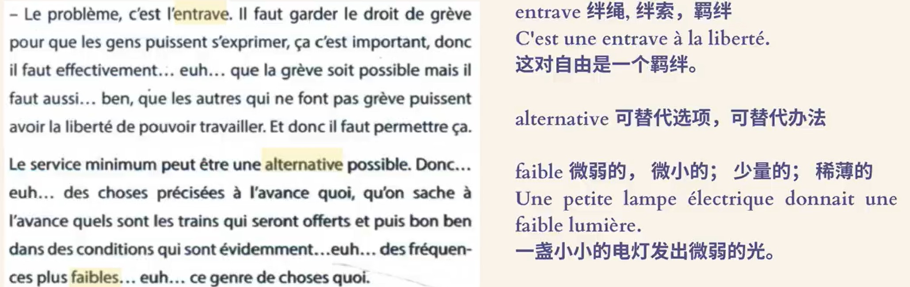

---

## 24.8.2 

1.  
2.  
3.  
4.  
5. de quel type de campagne s'agit-il ?
   1. campagne : 非商业广告
6. une personne courtoise : adj 礼貌的
   1. un geste courtois 
7. courtoisie : n. 礼貌
   1. leurs relations se bornent à la courtoisie 礼仪之交
8. les européens les plus polis au volant 
   1. au volant : 驾驶中
9. ceux qui conduisent le plus mal 
   1. apprendre à conduire 
10. en revanche = au contraire 
11. pas ... pour un sou : 一点也不
   1. pas modestes pour un sous, les Français se jugent à 93 pourcent bons conducteurs 
   2. il n'est pas méchant pour un sou 
12. les informations qui contredisent l'opinion que les conducteurs français ont d'eux-mêmes 
    1.  contredire : contradict 
    2.  ses actes contredisent ses paroles 
13. 

---

## 24.8.3

1. Doubler ou tourner sans mettre le clignotant
   1. clignotant: the light you turn on when swerving left or right 
2.  
2.  

---

## 24.8.4

1.  
1.  
1.  
1.  

---

## 24.8.5

1.  
2.  
2.  

---

## 24.8.6

2.  
2.  
2.  

---

## 24.8.7

2.  
   1. accroître : increase 
2.  
2.  

---

## 24.8.8

2.  
2.  

---

## 24.8.9

2.  
   1. vol : plane 
   2. veille : the previous day 
   3. animer : preside
   4. annuler : cancel
2.  

---

## 24.8.10

1. Apportez-moi ce livre 
2. apporter un élément nouveau à l'enquête 
   1. 给一份调查提供新的要素

---

## 24.8.11

2.  
2.  

---

## 24.8.12

1.  
1.  
2. invite les lecteurs à passer son message à l'intéressé(相关的人)
1.  

---

## 24.8.14

1.  

---

## 24.8.15

1.  
1.  

---

## 24.8.16

1.  
1.  

---

## 24.8.18

1. y compris les heures supplémentaires de l'ensemble des personnes en emploi à temps plein
   1. "Including the overtime hours of all full-time employees." 
2.  
2.  

---

## 24.8.19

1.  

---

## 24.8.20

1.  

Est-ce que tu peux me le prêter pendant deux jours 

Je vous informe que la cérémonie de mariage de ma fille aura lieu à l'église la semaine prochaine 

Tu peux me le demander si tu ne connais pas le numéro de téléphone de votre voison

Il ne s'aperçois que maintenant, mais il est trop tard

À l'en coire , les français savent comment jouir la vie 
Il fume beaucoup, alors le médicient lui a conseillé de l'arrêter
Il ne partage pas à cette idée, quant à moi, J'avais acune avis 
Grâce à la décision du gouvernment, la quality de des habitants de ce village a beaucoup amélirée